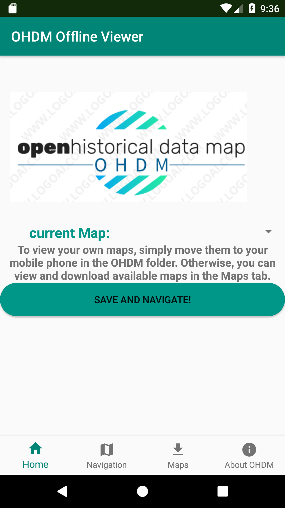
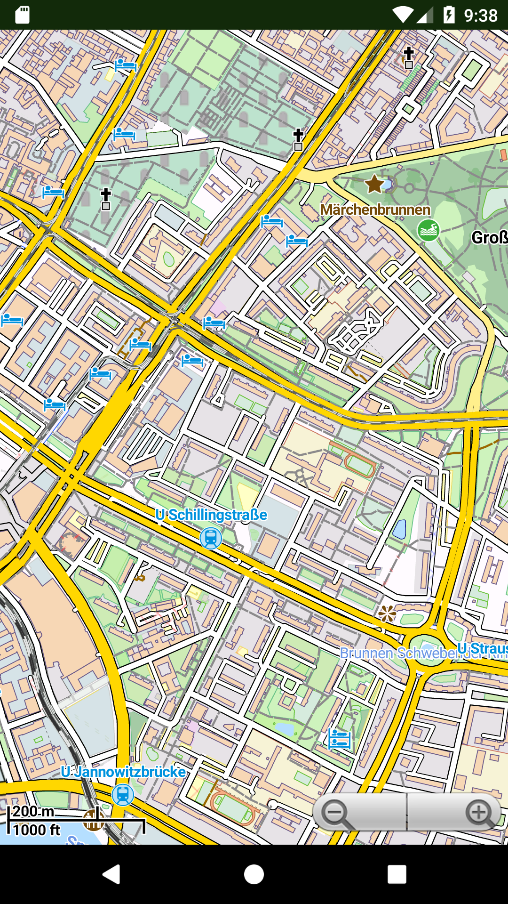
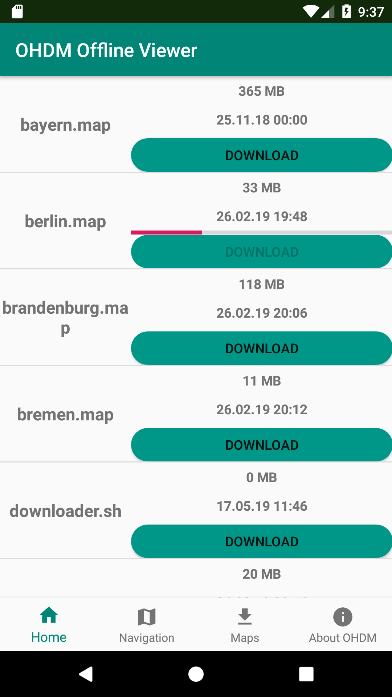
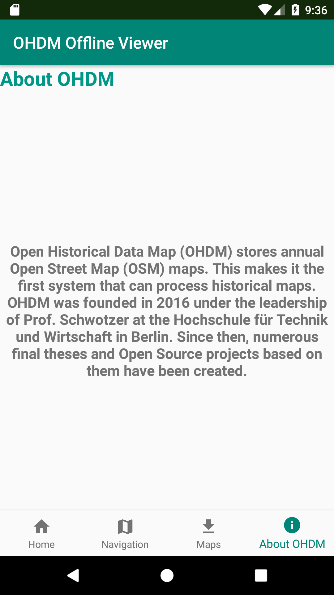

# OHDM Offline Viewer
> View OHDM maps offline
 






        
## Goal of this project
The goal of this repository is to be to render [Open Street Maps](https://www.openstreetmap.de/), without the need of a network connection.
To avoid caching dozens of different zoom layers, vector tiles are being used. 

## Getting Started
*Follow these instructions to build and run the OHDM Offline Viewer*
1. ```git clone https://github.com/OpenHistoricalDataMap/OfflineViewer.git```
2. [Install Android Studio](https://developer.android.com/sdk/index.html).
3. [Downlaod Open Historical Data maps](http://www.ohdm.net/)
4. Import the project. Open Android Studio, click `Open an existing Android
   Studio project` and select the project. Gradle will build the project.
5. Run the app. Click `Run > Run 'app'`. After the project builds you'll be
   prompted to build or launch an emulator. 
6. Place your maps on the device storage. There should be a ```OHDM``` directory in the internal storage. 

## Convert ```.osm``` to ```.map```-files
Were using [osmosis](https://github.com/openstreetmap/osmosis) with the [mapsforge-map-writer-plugin](https://github.com/mapsforge/mapsforge/blob/master/docs/Getting-Started-Map-Writer.md)
to conert ```.osm``` maps to ```.map```.
In order to use ```osmosis```, just execute ```/osm2map/osm2map.sh``` as sudo.

**The following code-block shows a successful execution:**
```
user@host:~$ sudo bash osm2map.sh 

Downloading osmosis to /opt/osmosis.
--2019-06-08 14:09:58--  https://bretth.dev.openstreetmap.org/osmosis-build/osmosis-0.46.tgz
Resolving bretth.dev.openstreetmap.org (bretth.dev.openstreetmap.org)... 193.60.236.13
Connecting to bretth.dev.openstreetmap.org (bretth.dev.openstreetmap.org)|193.60.236.13|:443... connected.
HTTP request sent, awaiting response... 200 OK
Length: 11696810 (11M) [application/x-gzip]
Saving to: ‘osmosis-0.46.tgz’

osmosis-0.46.tgz             100%[===========================================>]  11,15M  5,39MB/s    in 2,1s    

2019-06-08 14:10:00 (5,39 MB/s) - ‘osmosis-0.46.tgz’ saved [11696810/11696810]

bin/
...

Downloading mapwriter plugin /opt/osmosis.
  % Total    % Received % Xferd  Average Speed   Time    Time     Time  Current
                                 Dload  Upload   Total   Spent    Left  Speed
100 6170k  100 6170k    0     0  3177k      0  0:00:01  0:00:01 --:--:-- 3175k

Download and build successful finished.

	
osmosis usage:
    /opt/osmosis/bin/osmosis --rb file=path-to-osm-file.osm --mw file=destination-path-map-file.map

```

Then you can begin to convert your own ```map-files``` with:
```
/opt/osmosis/bin/osmosis --rb file=path-to-osm-file.osm --mw file=destination-path-map-file.map
```

## Use custom map-file download center
This application has an integrated download functionality for map files. 
This makes it possible to host various map files on a remote server. 
You then can easily download them using the app. 
The following steps will guide you through the installation and configuration:

**WARNING**

At this point of development, the download center is a simple FTP server that does not meet any security requirements.
Using it in productivity, will make your server extremely vulnerable.

**WARNING**


### Prerequisites
Were using ```docker``` and ```docker-compose``` to build the FTP server.

Go through the [official documentation](https://docs.docker.com/install/) in order to get both components installed.

### Build 
Open ```map-file-download-center/docker-compose.yml``` and change the ```environment``` vairables to your needs:
```
environment:
  FTP_USER: ohdm
  FTP_PASSWORD: ohdm
  FTP_USERS_ROOT: 
```

Now you can start the container with

```
docker-compose up
```

If successful, you should see 

```
vsftpd    | Received SIGINT or SIGTERM. Shutting down vsftpd
vsftpd    | Running vsftpd
``` 
at the end of the output. 
Great, now you can begin to adjust the source code to point the app to your ftp server

### Configure 
Open the file ```/app/src/main/java/de/htwBerlin/ois/Activities/MapDownloadActivity.java```:

and change the parameter with the values you jus used in the ```docker-compose``` file.:

``` 
private static final String FTP_SERVER_IP = "";
private static final Integer FTP_PORT = 21;
private static final String FTP_USER = "";
private static final String FTP_PASSWORD = "";
```

### Deploy
Just install the application on your device with Android Studio.

In order to host ```map```-files on the FTP server, just copy the files to ```/opt/ohdm/```

You then should the listed files in the ```Maps``` tab.

You can start the container with ```docker-compose up -d``` in background.

## Contact
Developed by: [FalcoSuessgott](https://github.com/FalcoSuessgott)

Project Link: [Open Historical Data Map](https://github.com/OpenHistoricalDataMap)

Institution: [HTW Berlin](https://www.htw-berlin.de/)

Mail: [info@ohdm.net](info@ohdm.net)
 